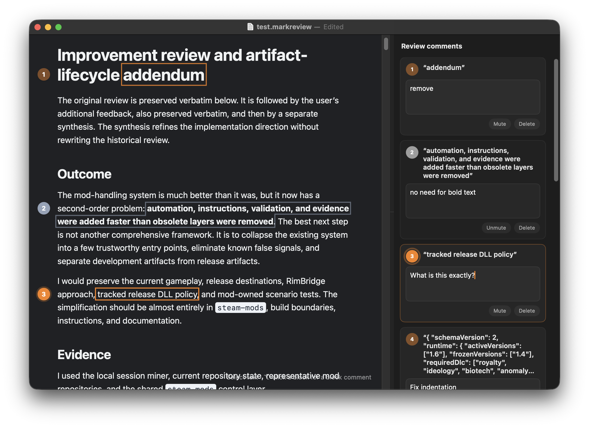

# MarkReview

Turn feedback on a Markdown document into clear instructions for an AI agent.

MarkReview gives you a comfortable place to read, select, and comment. When you
are done, save one `.markreview` file and give it directly to the agent. There
is no export step and no long prompt to assemble by hand.

<p align="center">
  
</p>

## Review without losing your train of thought

Long feedback is hard to write in a chat box. It is easy to lose the exact
sentence you meant, mix up comment numbers, or run out of time before the
prompt is ready.

MarkReview makes that work feel like reviewing a document:

- Open any Markdown file. The original file stays unchanged.
- Select text to add a comment, or Option-click a block to comment on the whole
  paragraph, heading, list item, or code block.
- See every comment beside the passage it refers to.
- Mute a comment when you want to keep it for later but do not want the agent to
  act on it.
- Close the app and continue another day. Your saved review and open windows
  come back when you return.
- Save the review and send the `.markreview` file to the agent.

## A complete prompt in one file

A `.markreview` file contains the original Markdown, your numbered comments,
the selected text, nearby context, section names, and source-line hints. It is
plain JSON, so it is easy to inspect, diff, and back up. It also carries a
short agent instruction that defines how comment states must be handled.

Comments have one of two clear states:

- `open` means the comment is an instruction the agent should act on.
- `muted` means the comment is kept for the reviewer but is non-actionable and
  must be ignored by the agent.

The file is the handoff. MarkReview does not keep a hidden database and does
not create a second export format.

## Simple, focused tools

- Linked highlights and comment cards make even short selections easy to find.
- Review numbers can be reset to top-to-bottom document order at any time.
- Reading size can be changed from the View menu, with Command-plus/minus/zero,
  by Option- or Command-scrolling, or with a trackpad pinch.
- Markdown and MarkReview files have different Finder icons.
- MarkReview follows the macOS accent color and supports light and dark mode.

MarkReview is a review tool, not a Markdown editor. It stores a snapshot of the
Markdown you opened, so later edits to the source file cannot silently change
the review. Remote images and raw HTML are not loaded as active web content;
the review stays local and text-focused.

## Run from source

MarkReview requires macOS 14 or later and a compatible Swift toolchain.

```sh
swift run MarkReview
```

The only direct third-party package is Apple's
[`swift-markdown`](https://github.com/apple/swift-markdown), used to turn the
source Markdown into the local preview. `swift-cmark` is brought in by that
package and is not used directly by MarkReview.

## Build the signed release app

The release script tests the project, creates a hardened Developer ID build,
submits it to Apple for notarization, staples the ticket, checks it with
Gatekeeper, and installs the verified app at `/Applications/MarkReview.app`.

```sh
./scripts/build-app.sh
```

The default setup expects the project maintainer's Developer ID certificate
and the `brrainz-notary` Keychain profile. A different setup can be supplied
with these environment variables:

- `MARKREVIEW_CODESIGN_IDENTITY`
- `MARKREVIEW_TEAM_ID`
- `MARKREVIEW_CODESIGN_KEYCHAIN`
- `MARKREVIEW_NOTARY_PROFILE`
- `MARKREVIEW_NOTARY_KEYCHAIN`

Temporary build, signing, or installation failures leave the previously
installed app in place.
